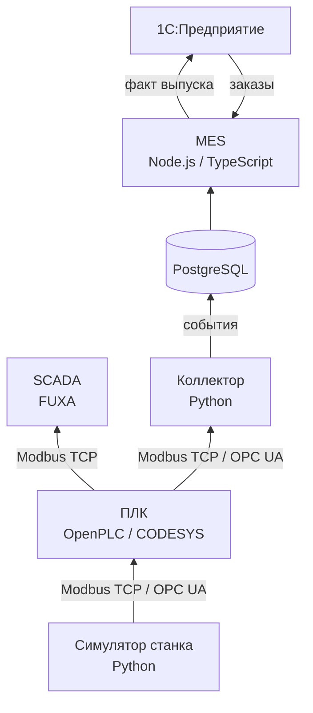

# smart-factory-lab

Стенд цифрового цеха: от станка с ЧПУ до 1С.

Проходит все уровни автоматизации производства (ISA-95): симулятор станка, ПЛК, SCADA, сбор данных, MES и обмен с ERP.

## Архитектура

| Уровень | Компонент | Назначение |
|---|---|---|
| 0–1 | `simulator/` | эмуляция станка: исполнение УП (G-code), статусы, счётчик деталей |
| 1 | `plc/` | логика управления (IEC 61131-3) |
| 2 | `scada/` | мнемосхема, тренды, журнал аварий |
| 2–3 | `collector/` | опрос оборудования, запись событий в БД |
| 3 | `mes/` | сменные задания, простои, OEE |
| 4 | `erp-1c/` | заказы на производство, учёт выпуска |

## Стек

Python 3.12 · Node.js 22 / TypeScript · PostgreSQL · Docker · Modbus TCP · OPC UA · FUXA · 1С:Предприятие 8.3

## Лицензия

[MIT](LICENSE)
